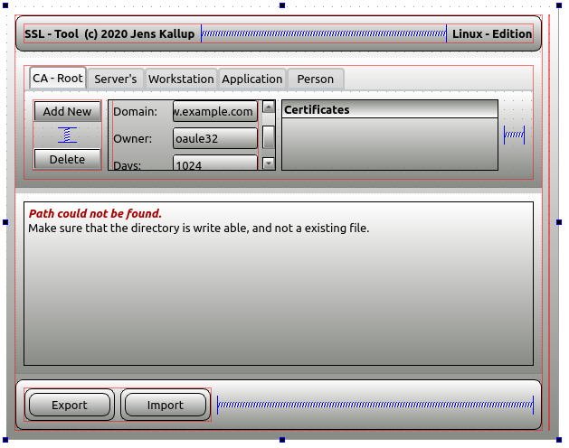

# **QDataTools** - ssl tool Rev.1
This package wull help you, to create SSL-Certificates.
Please don't use this actual package version in productive System.

1. create an CA,
2. create server,
3. and so on ...

